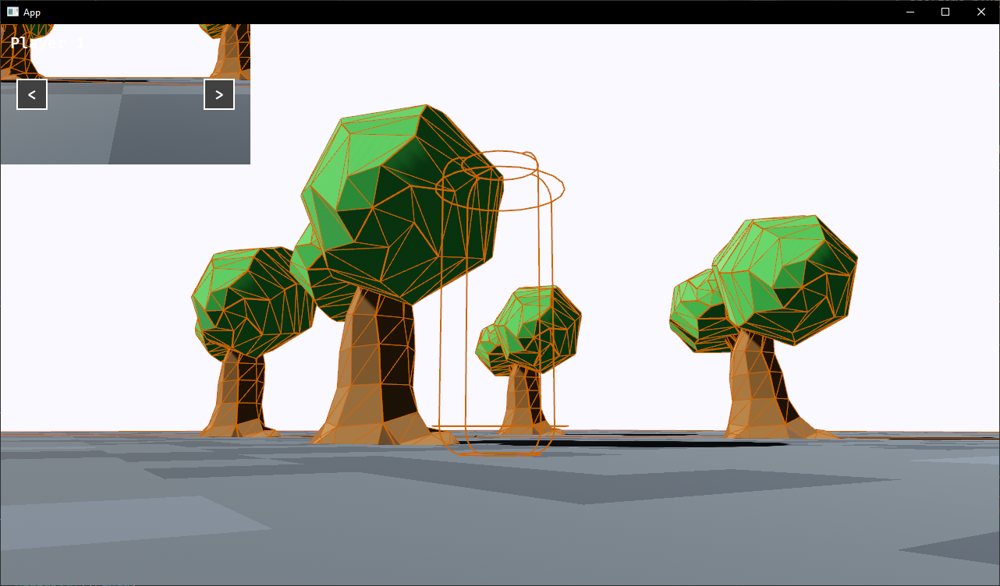

A simple/modest Work in Progress 3D platformer/Turn Based game done using Bevy (a Game Library made in Rust).  
Idea based on the ToonTown game.  

Gameplay in a third person way,  
Moving with wasd and the mouse,  
`a` to release the mouse, `esc` to quit.  
Run using the `cargo run --release` command and wait (or `cargo run` for the non-optimised version)  
